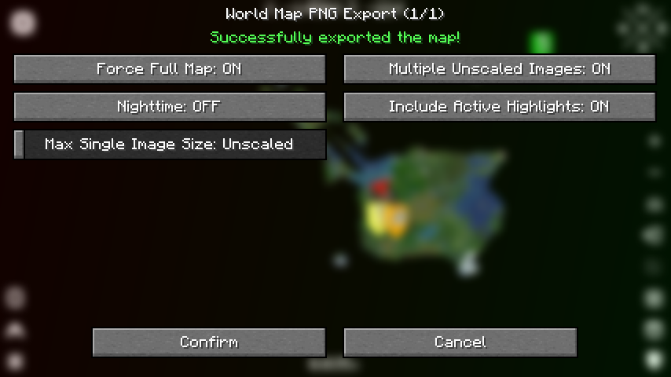

# ScJPMC map / ScJPマイクラ鯖マップ
ScJPマイクラ鯖マップ、**新バージョン**です。<small>*旧バージョン：[ScratchJP/mcscrmap_classic](https://github.com/scratchjp/mcscrmap_classic)*</small>

## 概要
ScJPMCサーバーのスペックはよわよわで、dynmapもbluemapも導入されてはさよならされる運命でした。\
だったら自分たちでマップを作っちゃおうと思ったわけです。

VueとLeafletを使って作られています。

## 使い方

### 開発用ローカルサーバーを開く
`npm run dev`

### マップ画像の生成
まずは[Xaero's World Map](https://chocolateminecraft.com/worldmap.php)でマップをPNG出力してください。\
<small>(出力する際はこの設定で出力してください↓)</small>

出力が完了したら、`src/input/(マップのディメンション)/`に出力された画像たちを入れてください。\
あとは`npm run tiles`を実行して、ディメンションを指定するだけで勝手に画像が生成されます。